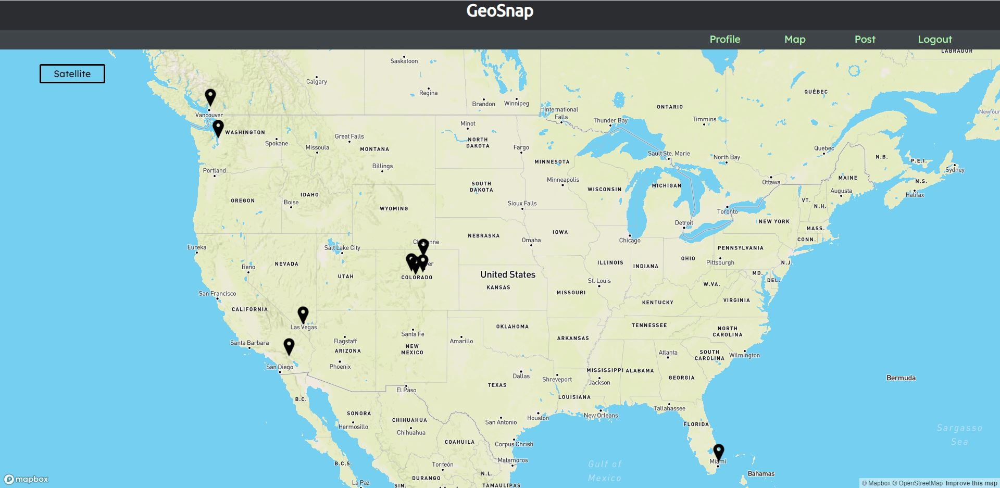

# GeoSnap

## Date: 4/19/2021

### By: Luke Arenas

#### [Website](https://lukearenas.github.io/Personal-Website/) | [GitHub](https://github.com/LukeArenas) | [LinkedIn](https://www.linkedin.com/in/lukearenas/)

---

### ***Description***

GeoSnap is a geo-tagging photo sharing app. It allows users to upload their photos to a specific address as well as see other user's posts. Additionally, users can comment on other photos they find intriguing. Explore the world and share your moments along the way!

### **Check out my deployed project** [HERE](https://powerful-caverns-31078.herokuapp.com/)

***

### ***Project Planning***

 #### [Workflow](https://trello.com/b/ldtpez9P/project-4) | [Dataflow](https://lucid.app/lucidchart/18b52644-5d9d-4760-a673-2eb4bf27469e/edit?beaconFlowId=7F0AFF8788B16EF9&page=0_0#) | [Entity-Relationship Diagram](https://app.diagrams.net/#G1h1Z65FbjTUahLoOKMMqkQ1Orr1iqi9WQ)

***

### ***Technologies***

* PostgreSQL
* Express
* React
* Node
* Mapbox
* Geocodio
* Redux
* AWS

***

### ***Back-end Decisions***

I decided to use Postgres and Express for the back-end because I find they have a good balance between structure and flexibility. Geocodio is used in the back-end to store coordinates in the db. Additionally, I was able to implement AWS to store and retrieve user's uploaded images. To minimize queries and requests to the db, I decided to send back User model information along with the posts and comments when they were being called. 

### ***Front-end Decisions***

React and Node suit my front-end needs through their component hierarchy. The redux functionality paired with React will help keep my project organized and scalable. The Mapbox API is the front-end of my geolocation functionality. The initial plan was to have three pages - the map, the create post form, and the post details. As the project evolved, I realized I needed to find a way to handle multiple posts at one location. This led me to design a feed page, which allows the user to see all the posts at that location from newest to oldest. With the addition of AWS, and the ability to upload a new profile picture, the app also required a profile page that would not only allow the user to upload their new photo, but also see all their own posts in chronological order.

### ***Screenshots***

***

### ***Future Updates***

- [ ] Cropping uploaded images
- [ ] Hashtags
- [ ] Private or Public Pictures
- [ ] Likes

***

### ***Credits***
* [Mapbox](https://visgl.github.io/react-map-gl/) (Front End Mapping)
* [geocodio](https://dash.geocod.io/) (Back End Geocoding)
* [npm](https://www.npmjs.com/package/uuidv4) (Postgres UUID)
* [Bootstrap](https://getbootstrap.com/docs/4.0/components/dropdowns/) (Dropdown Menu)
* [Google Fonts](https://fonts.google.com/) (Fonts)
* [Medium](https://medium.com/@650egor/react-30-day-challenge-day-2-image-upload-preview-2d534f8eaaa) (Uploaded Image Preview)
* [Stack Overflow](https://stackoverflow.com/) (General Code Debugging)
* [W3 Schools](https://www.w3schools.com/) (General Code Debugging/Reference)
* [MDN Web Docs](https://developer.mozilla.org/en-US/) (General Code Debugging/Reference)